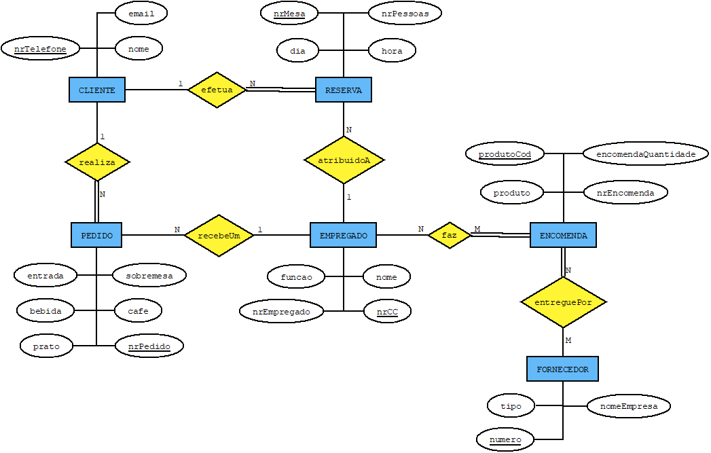

# C2 : Esquema conceptual

## Modelo E/A

## Regras de negócio adicionais (Restrições)
- Cada empregado de mesa fica, no máximo, encarregue de 4 mesas.
- Cada mesa fica ligada a reserva "X". 
- O chef ao propor os pratos a cozinhar nesse dia pede para o ajudante verificar o stock.
- O ajudante de cozinha fica encarregue dos contactos com fornecedores pois é ele quem verifica o stock.
- Se o fornecedor não tiver os produtos pedidos já não será possivel fazer o prato "X".
- Cada reserva deve ser cancelada com 24 hora de antecedência.
- Um cliente não fica restrito a reservar apenas uma mesa.

---
[< Previous](rebd01.md) | [^ Main](https://github.com/SIBD01/TrabalhoFinal) | [Next >](rebd03.md)
:--- | :---: | ---: 
