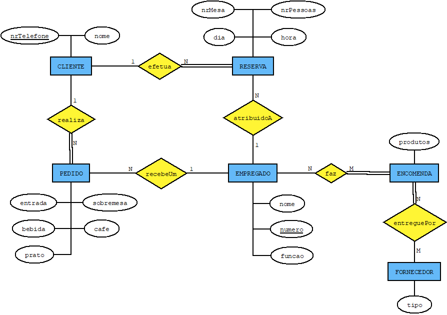

# C3 : Esquema conceptual

## Modelo E/A

### Entidades:

- CLIENTE(nome,nrTelefone)

Cada cliente está identificado por nome (primeiro e último) e número de telefone.

- RESERVA(dia, hora, nrMesa, nrPessoas)

Cada reserva é identificado por dia, hora e número de pessoas.

- EMPREGADO(nome, numero, funcao)

Cada empregado é identificado por nome, número de funcionário e função (rececionista, chefe de sala, empregado de mesa, chef e assistente de cozinha).

- PEDIDO(entrada, bebida, prato, sobremesa, cafe)

Cada pedido é feito com base em entrada, bebida, prato, sobremesa e café.

- FORNECEDOR(tipo)

Cada fornecedor é identificado pelo seu tipo.

- ENCOMENDA(produtos)

A encomenda efetuada faz o re-stock aos produtos do restaurante.

### Associações:

- efetua (CLIENTE,RESERVA) 1:N parcial/total

Cada cliente faz uma reserva.

- realiza (CLIENTE,PEDIDO) 1:N parcial/total

Um cliente realiza um pedido.

- faz (EMPREGADO,ENCOMENDA) N:M parcial/total

Um empregado faz uma encomenda.

- atribuidoA (EMPREGADO,RESERVA) 1:N parcial/parcial

Um empregado é atribuído a uma reserva.

- recebeUm (EMPREGADO,PEDIDO) 1:N parcial/parcial

Um empregado recebe um pedido.

- entreguePor (ENCOMENDA,FORNECEDOR) N:M total/parcial

Uma encomenda é entregue por um fornecedor.

### Diagrama de Peter Chen (Modelo Entidade-relação):   

Modelo EA da Base de Dados do restaurante. 

## Regras de negócio adicionais (Restrições)

-Cada empregado de mesa fica no máximo encarregue de 4 mesas.
-Cada mesa fica ligada a reserva "X". 
-O chef ao propor os pratos a cozinhar nesse dia pede para o ajudante verificar o stock.
-O ajudante de cozinha fica encarregue dos contactos com fornecedores pois é ele quem verifica o stock.
-Se o fornecedor não tiver os produtos pedidos já não será possivel fazer o prato "X".
-Cada reserva deve ser cancelada com 24 hora de antecedência.
-Um cliente não fica restrito a reservar apenas uma mesa.

---
[< Previous](rei02.md) | [^ Main](https://github.com/SIBD01/TrabalhoFinal/) | Next >
:--- | :---: | ---: 
